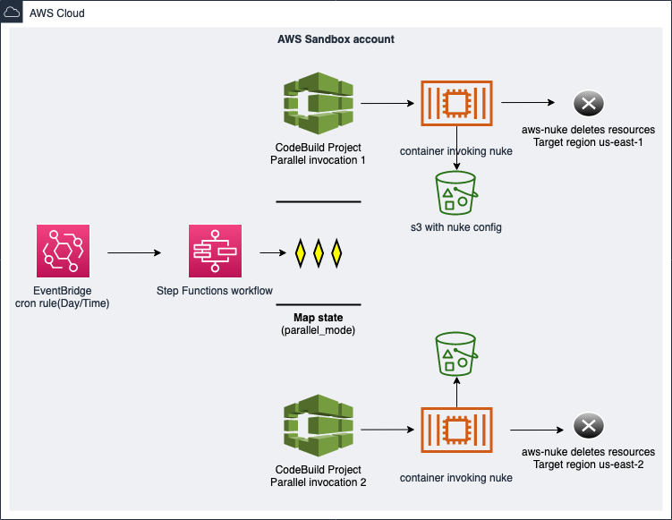

# AWS Nuke

Este projeto tem como objetivo implantar o AWS-Nuke em uma conta e permitir que seja possível fazer uma implantação do AWS Nuke e configurar para que o AWS-Nuke rode programado através de cronjob.

O que é o `aws-nuke` ? 

O aws-nuke é uma ferramenta que te auxilia na remoção de recursos AWS que não estão sendo utilizados.

# Casos de uso
- ambientes que são utilizado para testes e após a utilização podem ser destruídos para economizar no custos no fim do dia.
- Ambientes provisionados com a ferramenta `terraform` algumas vezes falham e alguns recursos ficam implantados e outros não, isso pode gerar uma bagunça na conta AWS, para evitar essa situação podemos rodar `aws-nuke` para que a conta fique sem nenhum recurso, assim mantendo organizada e sem gerar custo.

# Arquitetura da solução


# Como funciona
A solução foi implementada utilizando `IaC` (Infrastructure as Code) no caso terraform.

## requisitos
- uma conta AWS
- terraform

## Variáveis
- `project_name`: nome do projeto do codebuild.
- `region`: região aonde será implantada a solução.
- `aws_nuke_cron`: cronjob de execução do aws nuke.
- `emails_notification`: emails que serão notificados quando o aws_nuke for executado.
- `regions_to_nuke`: quais regiões o aws_nuke irá remover recursos.
- `nuke_aws_version`: a versão do aws_nuke
- `nuke_dry_run`: executar no modo dry-run (padrão false)

## Arquivo de configuração
O aws-nuke possui um arquivo estático que se encontra em `config/nuke_generic_config.yaml`, este arquivo permite que você faça configurações para definir quais recursos podem ser deletados, quais não podem ser deletados, filtro de contas que não podem ter recursos removidos. para maior compreensão das configurações do arquivo, visite o endereço https://github.com/rebuy-de/aws-nuke.

## Filtros do aws nuke

O filtro nos ajudam a filtrar recursos que não devem ser destruídos, para saber mais veja essa doc [02-FILTERS](docs/02-FILTERS.md).

## Proteger recursos para que não sejam removidos

Para que os recursos não sejam removidos é necessário adicionar a seguinte tag `proteted_from_nukes="true"` nos recursos, desta forma os recursos serão protegidos, e não será possível ser removido.

## Execução programada
A solução utiliza expressões cron para agendar a frequência das execuções, para saber mais leia esse [doc](docs/03-CRON.md).


## Implantação
Para executar a implatanção é necessário que o usuário que será utilizado para realizar a implantação tenha permissões necessárias.

```bash
$ terraform apply 
```

# Referências
- https://docs.aws.amazon.com/codebuild/latest/userguide/build-env-ref-compute-types.html
- https://github.com/aws-samples/aws-nuke-account-cleanser-example
- https://github.com/rebuy-de/aws-nuke
- https://docs.aws.amazon.com/pt_br/eventbridge/latest/userguide/eb-create-rule-schedule.html